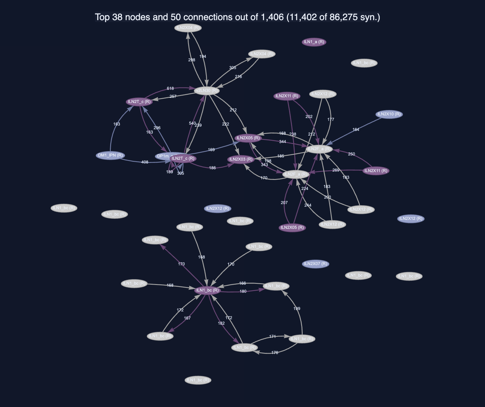
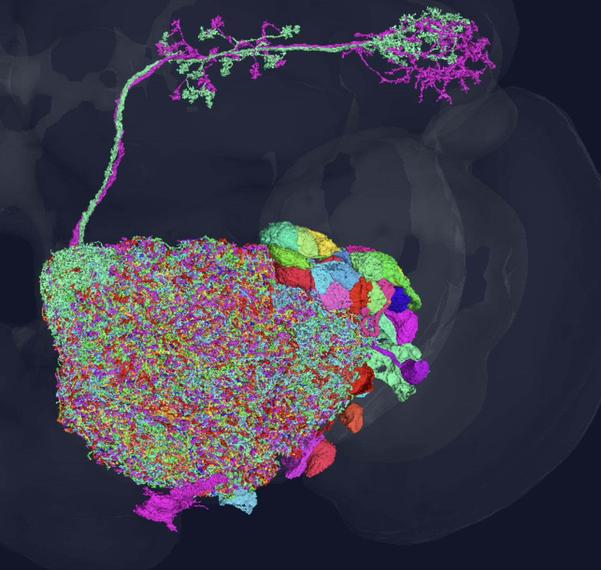

# A Conserved Recurrent Inhibitory Circuit in the Drosophila Antennal Lobe (FAFB)

---

## Visualizations

| Network Graph (top 50 connections by synapse count) | 3D Neuron Meshes in FAFB |
|:---:|:---:|
|  |  |

**[Open all 38 neurons in Codex 3D viewer →](https://codex.flywire.ai/app/view_3d?dataset=fafb&query=720575940622338742%2C720575940619071005%2C720575940637136752%2C720575940637623780%2C720575940640541091%2C720575940640803200%2C720575940610161091%2C720575940628059978%2C720575940640415859%2C720575940621542747%2C720575940621585279%2C720575940612347571%2C720575940646576436%2C720575940605758142%2C720575940648633988%2C720575940612637554%2C720575940629792732%2C720575940622650879%2C720575940660217729%2C720575940613804259%2C720575940630225403%2C720575940616758322%2C720575940616908177%2C720575940624832743%2C720575940623137997%2C720575940617299131%2C720575940614956072%2C720575940622726271%2C720575940625584484%2C720575940618112310%2C720575940625585508%2C720575940615708482%2C720575940623792648%2C720575940631603281%2C720575940626342174%2C720575940616197819%2C720575940631704716%2C720575940624435128&action=&dark_background=0)**

From the images above, the network graph shows two natural clusters: an lLN2 subtype group (upper with stronger individual connections (up to 618 synapses per pair)) and an lLN1_bc group (lower and more evenly distributed). The two projection neurons, DM1_lPN and DP1m_adPN, appear to be peripheral nodes receiving from the lLN2 center. Furthermore, the 3D mesh view shows all 38 neurons as a dense mass co-localized in the right antennal lobe, with the two projection neurons extending outward toward the body.

---

## What the Circuit Is

The 38 matched neurons in FAFB are all right-hemisphere, central, intrinsic neurons in the antennal lobe (AL_R). Thirty-six are Antennal Lobe Local Neurons (ALLNs) which are multiglomerular inhibitory interneurons that innervate many glomeruli simultaneously. Thirty five of those share the ALl1_dorsal developmental hemilineage, which means they were born from the same neuroblast lineage. The remaining two are projection neurons (DM1_lPN and DP1m_adPN) that project to the mushroom body calyx, represent the circuit's output pathway.

The dominant cell types are lLN1_bc (16 neurons) and various lLN2 subtypes (lLN2X12, lLN2X04, lLN2F_a, lLN2X11, lLN2T_c, lLN2X05 — 17 neurons combined). The lLN1 and lLN2 classes are the two main multiglomerular inhibitory populations in the Drosophila antennal lobe, known to span many or all glomeruli and coordinate activity across odor channels [1].

From the structure, all 1,406 possible directed edges are present, and all 703 unordered pairs are bidirectional. The 86,275 internal synapses are almost entirely in AL_R (99.98%). The mean connection strength is 61.4 synapses per directed pair, with the strongest single connection at 618 synapses (lLN2T_c → v2LN30).

The synapse-weighted neurotransmitter profile of the internal connections is cholinergic-serotonergic: ACH 38.4%, SER 34.2%, DA 18.6%, GABA 8.8%. It is important to note that per-neuron NT labels from Codex are ambiguous for 23 of the 38 neurons because the classifier confidence fell below threshold [2].

---

## What the Circuit Does

The antennal lobe is the fly's first olfactory processing center. Olfactory receptor neurons (ORNs) detect odors and pass signals to projection neurons (PNs), which relay those signals to the mushroom body and lateral horn for learning and behavior. Local interneurons (LNs) sit in the middle of this pathway and regulate how strongly PNs respond.

The key function of multiglomerular LNs is **lateral inhibition**. Specifically, when one glomerulus is strongly activated by an odor, the LNs spread that signal across many other glomeruli and suppress their output. This keeps the PN responses calibrated to the total odor intensity rather than saturating on strong odors, a process called **divisive normalization** [3]. Essentially, the LN network is sort of like a "volume knob", preventing any one odor channel from dominating and keeps the system sensitive across a wide range of odor concentrations.

The all-to-all bidirectional topology of the 38-neuron clique is also vital for this type of computation as well. Specifically, when two neurons mutually inhibit each other, their individual activity levels become coupled, meaning each is partially suppressed by the other's response. With all 703 pairs in the circuit doing this simultaneously, the result is a globally coordinated suppression that normalizes activity across all participating glomeruli. LN-LN reciprocal connections in the antennal lobe are also specifically implicated in bistable gain control, where the recurrent inhibitory network can switch between a mode that suppresses global activity (when odors are strong) and a mode that allows weak signals through (when odors are faint) [4].

The two embedded projection neurons (DM1_lPN and DP1m_adPN) are also among the strongest drivers in the circuit. Here, DM1_lPN sends 408 synapses to lLN2T_c and DP1m_adPN sends 305 synapses to the same target. Their presence inside this recurrent clique suggests the circuit also incorporates direct feedback from the output layer, and not just interneuron-to-interneuron inhibition. The circuit sits upwards of the mushroom body, with 9,701 synapses flowing from the clique members to KCab Kenyon cells and 4,881 to KCg-m Kenyon cells. This connects the recurrent LN network in the pipeline for olfactory learning and memory.

---

## Why It Appears in Three Connectomes

The same 38-neuron circuit, with identical directed topology, was found in the FAFB (female brain), BANC (female brain and ventral nerve cord), and MCNS (male whole CNS). These span both sexes and multiple body regions.

The antennal lobe is already known to be broadly stereotyped across individuals [5]. Finding the identical graph structure of a 38-neuron fully reciprocal inhibitory clique across male and female flies suggests this specific circuit is an exactly reproducible circuit. The antennal lobe is one of the two highest-reciprocity neuropils in the entire FlyWire connectome, and its neuropil-specific highly reciprocal neurons are predominantly inhibitory ALLNs [6]. The 38-neuron clique is a concrete example of this class of structure.

---

## Hypothesis

The 38-neuron reciprocal ALLN clique represents a conserved gain control module in the right antennal lobe. I hypothesize that this circuit sets the dynamic range of olfactory processing in the right hemisphere by implementing divisive normalization across the glomeruli it innervates. Because the circuit is structurally identical across male and female flies, its function is unlikely to be sex-specific. Instead, it may reflect a general-purpose computational unit for odor intensity normalization that is developmentally hardwired from the ALl1_dorsal lineage.

As a side note, you could directly test this. By this, I mean optogenetically silencing the 36 ALLN members of this circuit while recording from right-hemisphere projection neurons should specifically impair gain normalization. PN responses should saturate at lower odor concentrations and lose concentration-invariant identity coding, without equivalently affecting left-hemisphere PNs.

---

## References

[1] Chou, Y.H. et al. (2010). Diversity and wiring variability of olfactory local interneurons in the Drosophila antennal lobe. *Nature Neuroscience* 13, 439–449. https://doi.org/10.1038/nn.2489

[2] Eckstein, N. et al. (2024). Neurotransmitter classification from electron microscopy images at synaptic sites in Drosophila melanogaster. *Cell* 187, 2574–2594. https://doi.org/10.1016/j.cell.2024.03.016

[3] Olsen, S.R., Bhandawat, V. & Wilson, R.I. (2010). Divisive normalization in olfactory population codes. *Neuron* 66, 287–299. https://doi.org/10.1016/j.neuron.2010.04.009

[4] Berck, M.E. et al. (2016). The wiring diagram of a glomerular olfactory system. *eLife* 5, e14859. https://doi.org/10.7554/eLife.14859

[5] Schlegel, P. et al. (2024). Whole-brain annotation and multi-connectome cell typing quantifies circuit stereotypy in Drosophila. *Nature* 634, 139–152. https://doi.org/10.1038/s41586-024-07686-5

[6] Lin, A. et al. (2024). Network statistics of the whole-brain connectome of Drosophila. *Nature* 634, 153–165. https://doi.org/10.1038/s41586-024-07968-y
